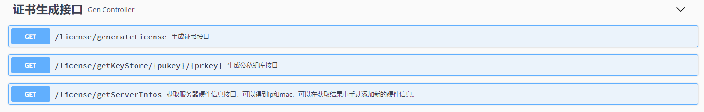
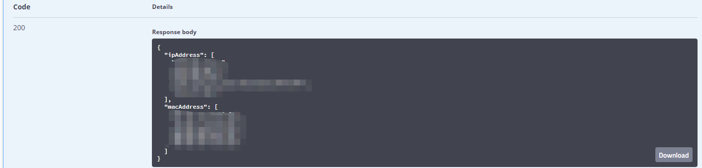
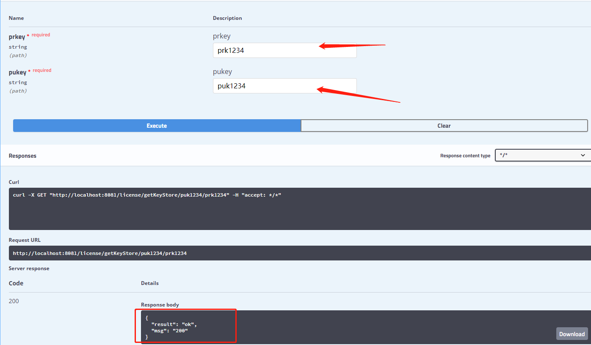
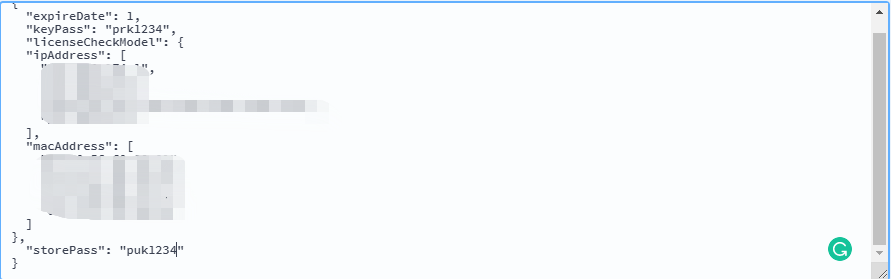
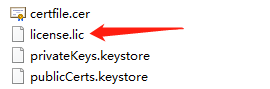

# License证书生成工具

本工具基于**Springboot 2.3.0.RELEASE**开发，使用 **TrueLicense** 生成License，解决的问题场景是：应用部署在客户的内网环境。因为这种情况开发者无法控制客户的网络环境，而要实现应用收费，到期后禁止使用，通常的做法是使用服务器许可文件，在应用启动的时候加载证书，然后在请求应用程序时对证书进行验证，实现到期禁用的目的。

本工具作用：本工具利用JDK自带的keytool工具生成公私钥库，并利用有效期，ip地址，mac地址等信息生成认证证书。这样在客户端部署时，只需要安装证书，并利用公钥库进行验证即可实现访问许可检验。

### 运行环境：

**Java8+**

### 用法：

项目集成Swagger，并提供三个接口，分别是：

- 服务器硬件信息获取（如ip，mac）
- 公私钥库生成
- 证书生成

项目构建成功后启动项目,访问如下地址:

`http://localhost:8081/swagger-ui.html`



#### 步骤一：

首先访问`/license/getServerInfos`获取部署服务器的ip和mac信息，结果如下形式json串，**要把返回结果保存，之后用于证书生成**。



#### 步骤二：

再访问`/getKeyStore/{pukey}/{prkey}` 传入你的公私钥密码，**密码一定要大于6位，否则生成不成功**。**这个密码一定要保存好，尤其私钥，不可交给客户**。 

字段：prkey是私钥密码  pukey是公钥密码。这两个值下面也会用到。



生成成功后，会在项目路径下生成如下目录结构和文件：


#### 步骤三：

最后一步，根据秘钥库，有效时间，硬件信息生成认证证书。访问：`/generateLicense`

##### 参数讲解：

```json
{
  "expireDate": 0, //有效期 单位是天 从生成证书开始算起 多长时间内有效。
  "keyPass": "string",  // 私钥密码，也就是生成公私钥库接口中传入的 prkey字段   note：一定保存好且不可交给客户
  "licenseCheckModel": {  // 这个就是服务器硬件信息了 ， 将服务器硬件信息获取接口 返回的结果 放到这里即可。
    "ipAddress": [
      "string"
    ],
    "macAddress": [
      "string"
    ]
  },
  "storePass": "string"   // 公钥密码 也就是生成公私钥库接口中传入的 pukey字段
}
```

最后请求结果如图：



请求成功后，会在路径下生成证书文件




**项目参考地址**：[Spring Boot项目中使用 TrueLicense 生成和验证License](https://www.zifangsky.cn/1277.html)

改进：

- [x] 集成公私钥生成接口，无需手动执行命令
- [x] 整合Swagger提供外部访问接口
- [x] 简化服务器硬件信息获取逻辑
- [x] 简化证书生成接口，配置内化，只需要用户输入简单参数，降低使用难度。

